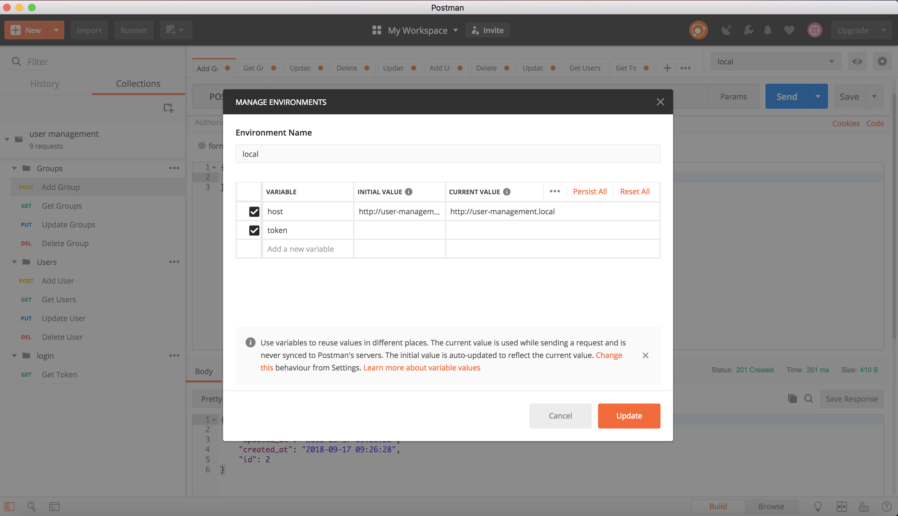

## Minimal User Management API (with Laravel)

This project shows basic methods for API authentication and user management.


### What we have 

- Domain model (UML) and use case diagram for these processes -> check /extra_files/diagrams
- Postman collection for testing all API routes -> check /extra_files/diagrams/postman_collection
- REST API
- API authentication base on Bearer token 
- CRUD for users and groups
- ManyToMany relation between users and groups model
- Migration for users, groups and admins table
- Seeder for admins table

## Installation

- clone project in your desired destination
- create database
- rename .env.example file to .env
- edit .env file and enter your environment variables here (like DB_DATABASE, DB_USERNAME etc)
- on terminal run: ```php artisan key:generate``` --> generates your application key
- run ```php artisan migrate``` --> creates admin, users, groups tables
- run ```php artisan db:seed``` --> adds one admin (email: 'admin@admin.com', 'password': '12345678')
- go to postman and import collection from extra_files/collection
- on postman add host to your environment variables
<p align="center">
  
</p>
- on postman run Get Token request under Login folder and copy token
- add another variable called token and paste the value
- start calling other requests according to examples

